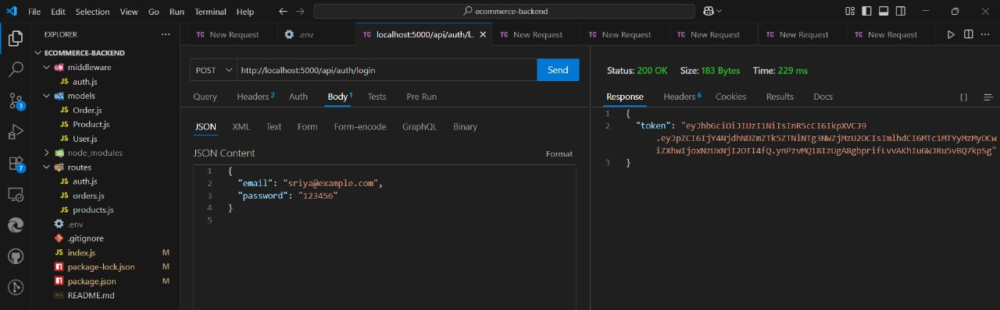
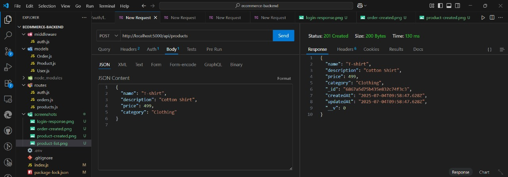
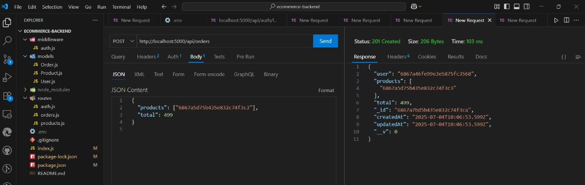

# 🛍️ E-Commerce Backend API

A fully functional RESTful backend API for an e-commerce platform, built using **Node.js**, **Express**, and **MongoDB Atlas**.  
This backend supports **user authentication**, **product management**, and **order handling**, all secured via **JWT-based middleware**.

---

✅ You now officially have a fully working e-commerce backend API, with:

- 👤 User Registration & Login (JWT-authenticated)  
- 🛡️ Middleware-protected routes  
- 📦 Product Creation & Retrieval  
- 🛒 Order Placement & Viewing  
- 🔍 Filtering & Pagination Support

🎯 **Project Ready** for Deployment, Integration, or Extension!  
Perfect for portfolios, internships, freelance gigs, or real-world startup apps.

---

## ⚙️ Tech Stack

Built with modern technologies:

- **Node.js** – JavaScript runtime for the server
- **Express.js** – Fast, minimalist web framework
- **MongoDB Atlas** – Cloud NoSQL database
- **Mongoose** – Elegant MongoDB object modeling
- **JWT (jsonwebtoken)** – Secure token-based authentication
- **bcryptjs** – Password hashing
- **dotenv** – Environment variable management
---

## 📁 Folder Structure
```ecommerce-backend/
│
├── models/
├── routes/
├── middleware/
├── screenshots/
│ ├── login-response.png
│ ├── product-created.png
│ ├── products-list.png
│ └── order-response.png
├── .env
├── index.js
├── package.json
└── README.md
```

## 🔐 Environment Variables

Create a `.env` file in your root directory:

```PORT=5000
MONGO_URI=your_mongo_connection_string
JWT_SECRET=sriyasecret123
```
---

## 🧪 API Testing Flow (Sample)

✅ 1. Register User  
**POST** `/api/auth/register`

```json
{
  "name": "Sriya",
  "email": "sriya@example.com",
  "password": "123456"
}
✅ 2. Login User  
**POST** `/api/auth/login`

Returns a JWT token:

```json
{
  "token": "eyJhbGciOiJIUzI1NiIsIn..."
}
```



✅ 3. Add Product (Protected)  
**POST** `/api/products`

```json
{
  "name": "T-shirt",
  "description": "Cotton Shirt",
  "price": 499,
  "category": "Clothing"
}
```



✅ 4. Get All Products  
**GET** `/api/products`

Supports filters like:

```
?page=1&limit=5&category=Clothing
```


✅ 5. Create Order (Protected)  
**POST** `/api/orders`

```json
{
  "products": ["6867a5d75b435e832c74f3c3"],
  "total": 499
}
```



---

## 👩‍💻 Author

**Sriya Chirumamilla**  
Backend Developer | Web Development Enthusiast
